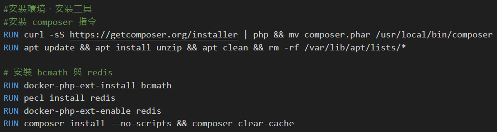

# laravel-app
 Set up Laravel, Nginx, and Mysql With Docker composer

 #### 主要參考網站
 https://medium.com/@CloudTopG/how-to-install-and-set-up-laravel-nginx-and-mysql-with-docker-compose-on-ubuntu-20-04-291462d7202d

問題條列:
- 無法透過docker-compose的方式直接將database的使用者建立起來
- 也有遇到docker build完成之後，發現composer install有部分安裝未完全，需要再進去php裡面進行composer install

透過以下網址的step 9 可以獨立將Mysql用戶建立起來
https://www.digitalocean.com/community/tutorials/how-to-set-up-laravel-nginx-and-mysql-with-docker-compose-on-ubuntu-20-04#step-3-persisting-data

#### 如何使用
將此檔案下載到自己的git clone到自己的空間
CD到此檔案下，先`docker build app`，將image建立好
再進行`docker-compose up`即可進行Nginx、Mysql、Laravel的使用

:::warning
若有資料庫等設定問題，需要更改 `.env`檔案，以及`docker-compose.yml`的environment的設定
:::

